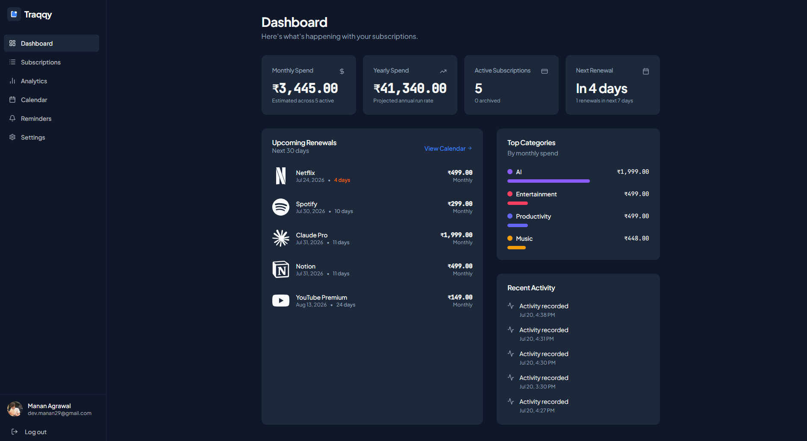
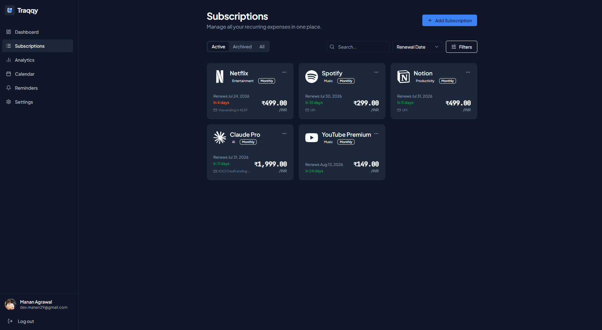
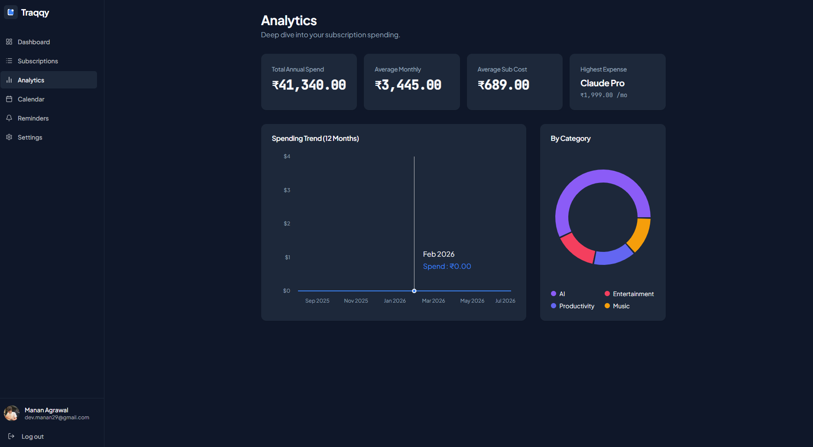
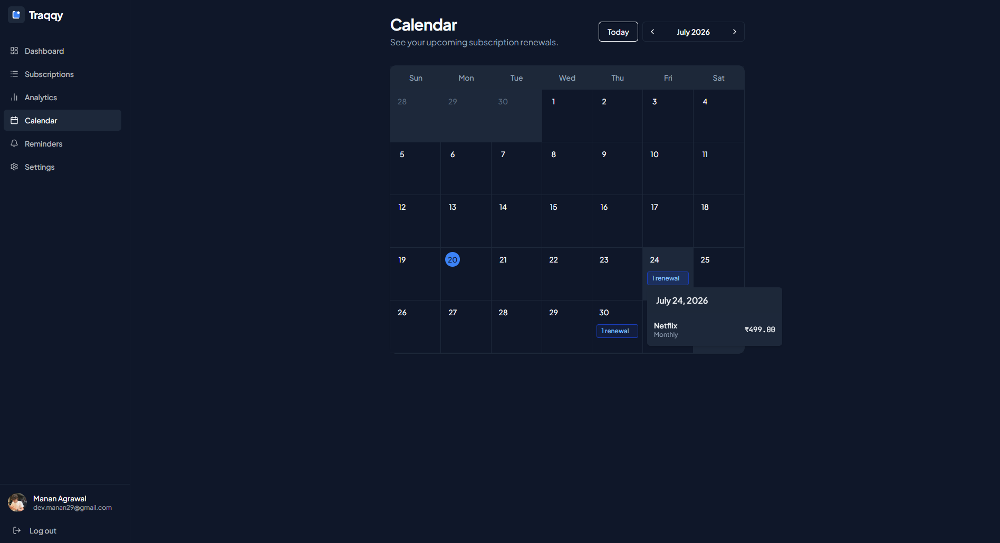

<div align="center">


<br>
<br>

### Subscriptions. Sorted.

Track every recurring payment in one place.
No bank connections. No email scanning. No surveillance.

<br>

[](https://github.com/MananAgrawal29/Traqqy)

</div>

<br>

<div align="center">
  
</div>

<br>

---

<br>

<table>
<tr>
<td width="50%" valign="top">

### Track

Manage all recurring payments in one place.

Recurring, trial, and lifetime subscriptions — each handled the way it should be. Organize by category, set billing cycles, and track across multiple currencies.

- 520+ recognized services
- Recurring, trial, and lifetime types
- Multiple billing cycles
- 62 currencies

</td>
<td width="50%" valign="middle" align="center">
  
</td>
</tr>
</table>

<br>

<table>
<tr>
<td width="50%" valign="middle" align="center">
  
</td>
<td width="50%" valign="top">

### Understand

See where your money goes and how your spending changes.

Spending analytics with category breakdown, trends over time, and a Wallet Health score built entirely from your own data. Every factor explained. Every recommendation actionable.

- Spending analytics with category breakdown
- Wallet Health scoring (0–100)
- Personalized recommendations
- No external APIs or AI scoring

</td>
</tr>
</table>

<br>

<table>
<tr>
<td width="50%" valign="top">

### Share

Track shared subscriptions and understand who pays what.

Split costs equally or set custom amounts. See your personal share clearly — never the full subscription price when it isn't yours alone.

- Equal and custom cost splitting
- Per-person share tracking
- Your share, clearly visible

</td>
<td width="50%" valign="middle" align="center">
  
</td>
</tr>
</table>

<br>

<div align="center">

### Know exactly when renewals are coming.

</div>

<br>

<div align="center">
  
</div>

<br>

---

<br>

<div align="center">

## Your data stays yours.

Traqqy works entirely from what you enter.
No invasive permissions. No hidden tracking.

<br>

<table>
<tr>
<td align="center" width="33%">

**No bank access**

We never connect to your bank or read balances.

</td>
<td align="center" width="33%">

**No email scanning**

Your inbox stays private and untouched.

</td>
<td align="center" width="33%">

**No SMS reading**

We don't read your messages. Ever.

</td>
</tr>
</table>

</div>

<br>

---

<br>

<div align="center">

<table>
<tr>
<td align="center" width="25%">

**Trial & Lifetime**

Track free trials and one-time purchases alongside recurring subscriptions.

</td>
<td align="center" width="25%">

**62 Currencies**

INR, USD, EUR, GBP, JPY, and dozens more — each formatted correctly.

</td>
<td align="center" width="25%">

**Wallet Health**

Your subscription wallet gets a personalized health score with explainable factors.

</td>
<td align="center" width="25%">

**Dark & Light**

Switch between themes. Your preference is remembered.

</td>
</tr>
<tr>
<td align="center" width="25%">

**Cost Sharing**

Split shared subscriptions equally or with custom amounts per person.

</td>
<td align="center" width="25%">

**520+ Services**

Recognized services with proper logos, from Netflix to Railway to Claude.

</td>
<td align="center" width="25%">

**Renewal Calendar**

See every upcoming renewal on a visual calendar with event counts.

</td>
<td align="center" width="25%">

**Categories**

Organize subscriptions by category and see where your money goes.

</td>
</tr>
</table>

</div>

<br>

---

<br>

<div align="center">

### Tech Stack

<br>

**Frontend**
React · TypeScript · Vite · Tailwind CSS · shadcn/ui · TanStack Query · Wouter

<br>

**Backend**
Node.js · Express · PostgreSQL · Drizzle ORM

<br>

**Auth**
Clerk

</div>

<br>

---

<br>

<div align="center">

### Getting Started

</div>

```bash
# Clone
git clone https://github.com/MananAgrawal29/Traqqy.git
cd Traqqy

# Install
pnpm install

# Environment setup
# Frontend: artifacts/subtrack/.env.local
# Backend:  artifacts/api-server/.env

# Run
pnpm dev
```

<br>

---

<br>

<div align="center">

### Roadmap

<br>

| Status | Milestone |
|--------|-----------|
| ✅ | Subscription tracking (recurring, trial, lifetime) |
| ✅ | Dashboard, Analytics, Calendar |
| ✅ | Wallet Health scoring |
| ✅ | Cost sharing (equal & custom) |
| ✅ | 520+ service catalog with logos |
| ✅ | Dark & light mode |
| 🔧 | Reminders delivery (production cron) |
| 🔧 | Production deployment |
| 💡 | PWA support |
| 💡 | Import & export |

</div>

<br>

---

<br>

<div align="center">


<br>
<br>

**Built by Manan Agrawal**

Traqqy — Subscriptions. Sorted.

</div>
