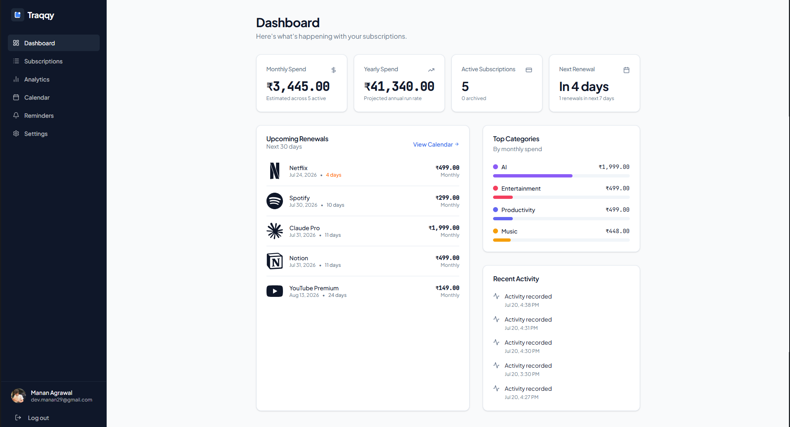
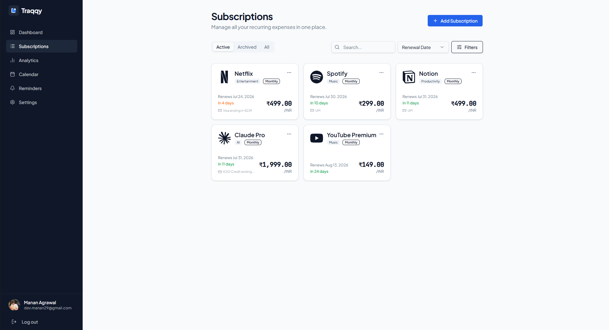
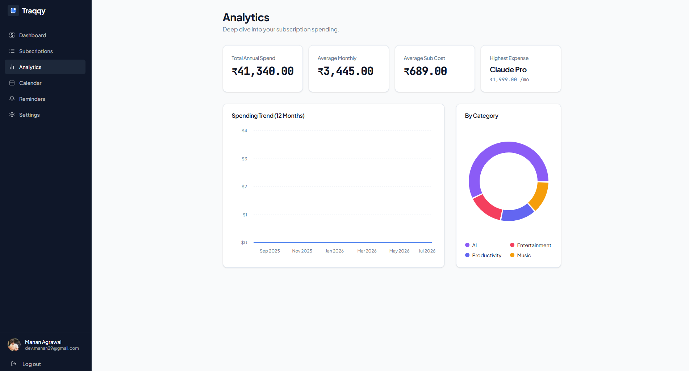
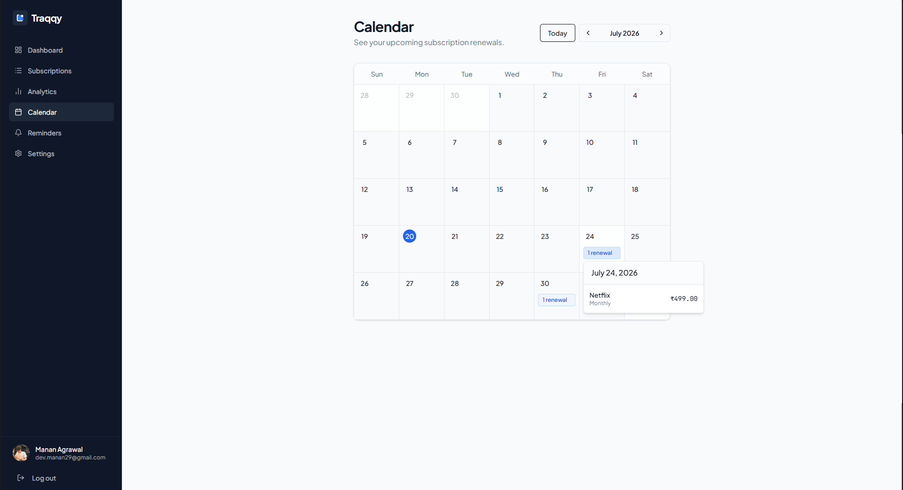
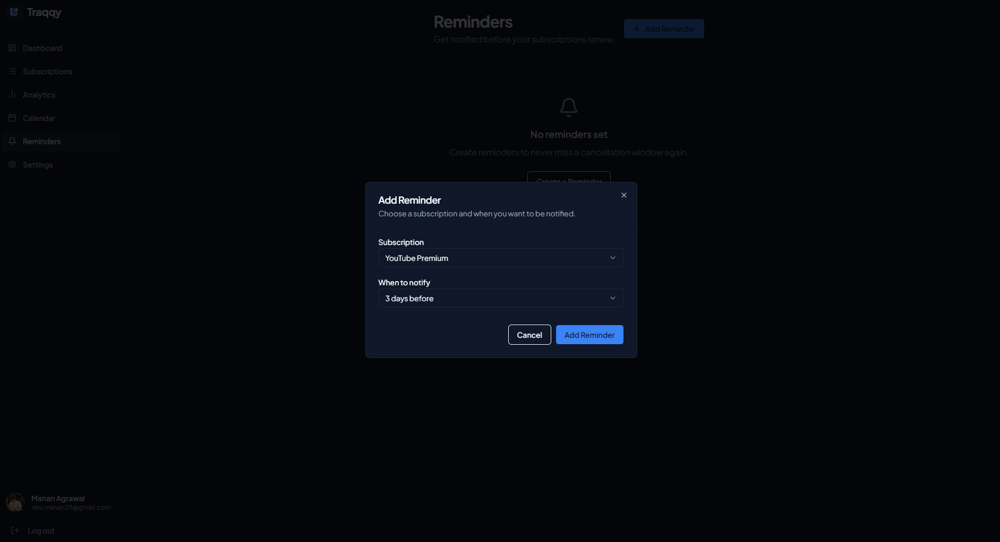
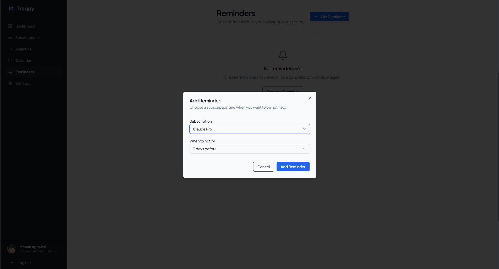
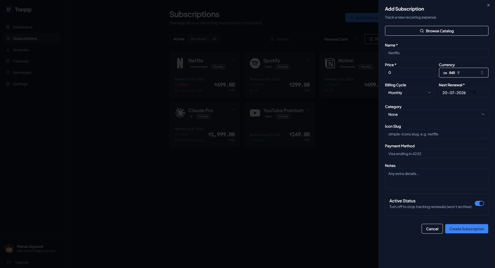
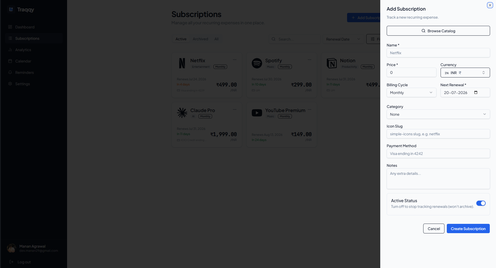

# Traqqy

### Finally, a subscription tracker that isn't another subscription.

Track subscriptions, recurring payments, and recharge plans — all in one place.

**Privacy-first • No bank access • No email scanning**

---

## ✨ Overview

Traqqy is a modern subscription and recurring payment tracker designed to help you stay on top of your expenses.

Instead of connecting your bank account or scanning your emails, Traqqy gives you complete control by letting you manage everything manually in a fast, clean, and privacy-focused interface.

Whether it's Netflix, Spotify, ChatGPT Plus, Adobe Creative Cloud, Jio, Airtel, or any recurring payment, Traqqy keeps everything organized in one place.

---

# 🚀 Features

### 📊 Dashboard

- Monthly & yearly spending overview
- Upcoming renewals
- Active subscriptions
- Recent activity
- Category insights

---

### 💳 Subscription Management

- Add subscriptions
- Edit subscriptions
- Organize with categories
- Multiple billing cycles
- Payment methods
- Notes
- Renewal tracking

---

### 📅 Calendar

Visual calendar showing every upcoming renewal.

---

### 📈 Analytics

- Monthly spending
- Category distribution
- Spending trends
- Highest recurring expenses

---

### 🔔 Reminders

Create reminders before renewals so you never miss a payment or cancellation window.

---

### 🎨 Beautiful UI

- Light Mode
- Dark Mode
- Responsive Design
- Clean Dashboard
- Smooth User Experience

---

### 🔒 Secure Authentication

Authentication powered by Clerk.

---

# 🛡 Privacy First

Traqqy **does not**

- ❌ Read your emails
- ❌ Read your SMS
- ❌ Connect to your bank account
- ❌ Sell your financial data

Your subscription data stays under your control.

---

# 📸 Screenshots

## Dashboard

  
  

---

## Subscription Management

  
  

---

## Analytics

  
  

---

## Calendar

  
  

---

## Reminders

  
  

---

## Add Subscription

  
  

---

# 🛠 Tech Stack

### Frontend

- React
- TypeScript
- Vite
- Tailwind CSS
- shadcn/ui
- TanStack Query
- Wouter

### Backend

- Node.js
- Express
- PostgreSQL
- Drizzle ORM

### Authentication

- Clerk

---

# 🗺 Roadmap

### UI & UX

- [ ] Refine UI components
- [ ] Improve landing page
- [ ] Better animations
- [ ] Enhanced mobile responsiveness

### Catalog

- [ ] Add Jio
- [ ] Add Airtel
- [ ] Add Vi
- [ ] Add BSNL
- [ ] Add more subscription logos

### Features

- [ ] Recharge plan tracking
- [ ] Subscription editing improvements
- [ ] Better reminders
- [ ] Import & Export
- [ ] PWA support

---

# 🎯 Philosophy

Most subscription trackers eventually become subscriptions themselves.

Traqqy is built around a simple idea:

> Track your recurring payments without sacrificing your privacy.

No unnecessary complexity.

No hidden costs.

Just a clean and reliable way to manage recurring expenses.

---

# 🤝 Contributing

Contributions, ideas, feature requests, and bug reports are welcome.

If you have suggestions for improving Traqqy, feel free to open an issue or submit a pull request.

---

Built with ❤️ by **Manan Agrawal**

### Traqqy

**Track smarter. Spend wiser.**

